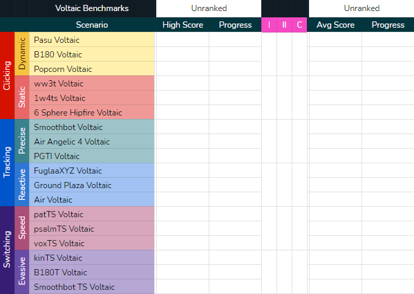
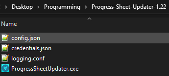

<h1 align="center">Progress Sheet Updater</h1>
<p align="center">
    
</p>

## About

This tool updates your [Voltaic Benchmark Progress Sheet](https://docs.google.com/spreadsheets/d/1L6iCXTaSheZtVwtVR4b_FYJzcCZbEYVRsdFo7PI3HTk/) with high scores and averages of completed challenges on [KovaaK](https://store.steampowered.com/app/824270/KovaaK_20/).

Run it before checking your progress sheet, or leave it running in the background to keep your sheet up-to-date as you play.

Easily keep track of additional scenarios beyond the scope of the Voltaic Benchmarks through the configuration file.

## Quickstart Guide

1. Download and extract the [latest release](https://github.com/VoltaicHQ/Progress-Sheet-Updater/releases).

2. Go [here](https://developers.google.com/sheets/api/quickstart/python#step_1_turn_on_the), and ensure you are logged in to the same Google Account that owns your progress sheet.

    1. Click the blue `Enable Google Sheets API` button.
    2. Click `Next` in the bottom-right.
    3. Click `Create` in the bottom-right.
    4. Click the blue `DOWNLOAD CLIENT CONFIGURATION` button.
    5. Move the `credentials.json` file to your extracted folder, alongside `ProgressSheetUpdater.exe` and `config.json`.
    
<p align="center">
    
</p>

3. Open `config.json` in your text editor of choice and add your sheet's ID. Then save and close the file.

 

```
{
    ...
    "sheet_id": "175i2Us2Vyi3eauSe5rWE94KE4DmIJE_iusa2d4OvC3E",
    ...
}
```

You can edit the options in this config to your liking.
```
"stats_path":  
Here you input the path to your Kovaak's stats folder, for most people it is  
"C:\\Program Files (x86)\\Steam\\steamapps\\common\\FPSAimTrainer\\FPSAimTrainer\\stats".
Make sure you use "\\".
```
```
"sheet_id":  
Here you input the id of your Progression Sheet.  
To get the id you need the part between the "d/" and the "/edit"   
For "ht<span>tps://</span>docs.google.com/spreadsheets/d/abcde12345xyz/edit#gid=316103388" it would be "abcde12345xyz"   
```
```
"highscore_ranges":  
Here you input the range where the highscores will be pasted into, keep them at the preset if you do not wish to add extra scenarios to track.   
```
```
"average_ranges":  
Here you input the range where the averages will be pasted into, keep them at the preset if you do not wish to add extra scenarios to track.  
```
```
"update_sheet_on_startup":  
If "true" this updates your sheet on startup of the program, using all runs u played even when the program was not running.  
If "false" this will not update your sheet on startup.  
```
```
"calculate_averages":  
If "true" the program calculates the averages of your last x runs.  
If "false" it does not.  
```
```
"num_of_runs_to_average":  
Here you input the number of runs you want to use to calculate the averages.  
```
```
"polling_interval":  
Here you input the time between updates to the sheet.  
Polling rates lower than 60 are not advised to use.
```

4. Run `ProgressSheetUpdater.exe`.

    1. Choose the account that owns your progress sheet.
    2. Click `Advanced` in the bottom-left, then `Go to Quickstart (unsafe)`.
    3. Click `Allow`.
    4. Click `Allow` again. A file called `token.pickle` will be saved to avoid future prompts.

5. Beat your high scores.

## Build It Yourself

Windows with Python 3.7+,

```bash
$ git clone https://github.com/VoltaicHQ/Progress-Sheet-Updater
$ cd Progress-Sheet-Updater
$ pip install -r requirements.txt
```

Edit the paths in `main.spec` to match your setup.

```bash
$ pyinstaller main.spec main.py
```
